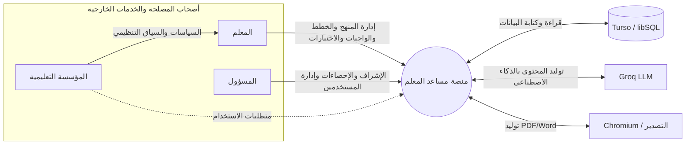
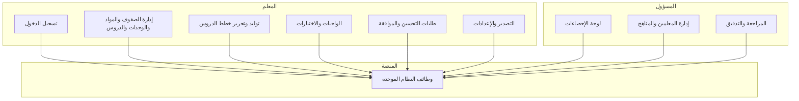
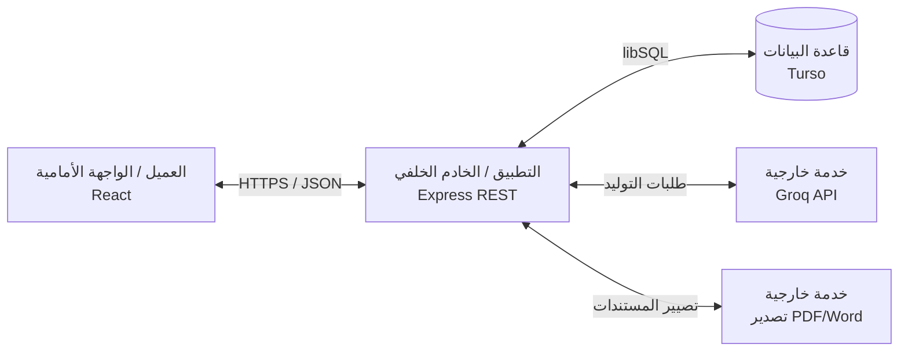
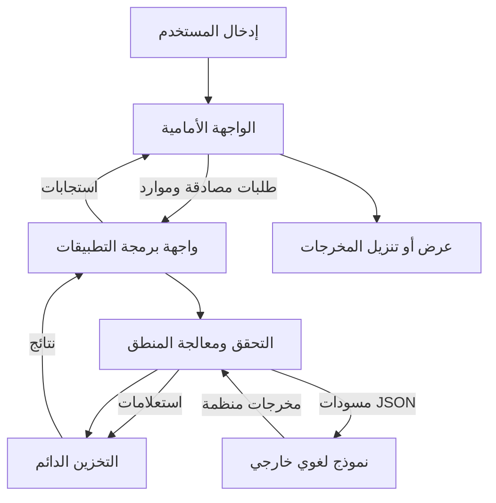
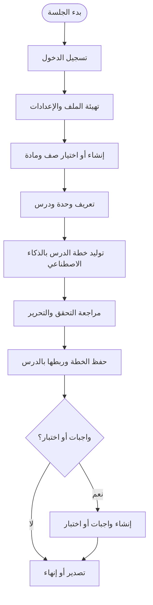
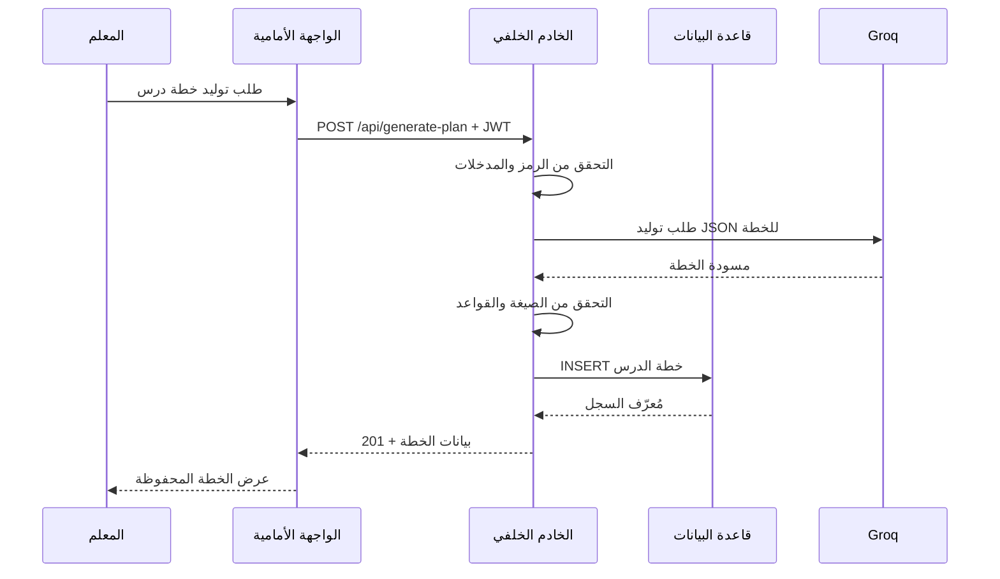
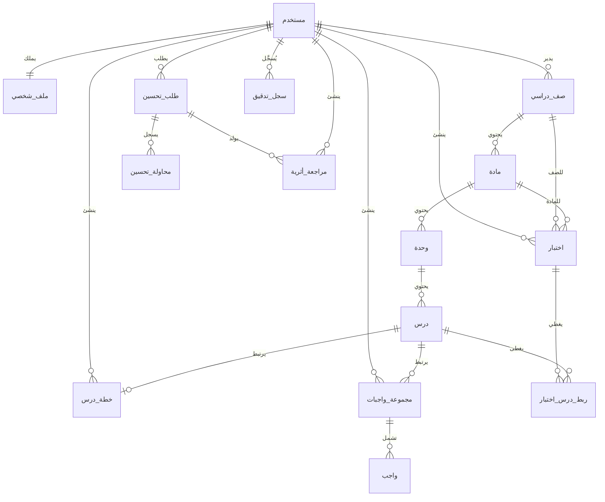
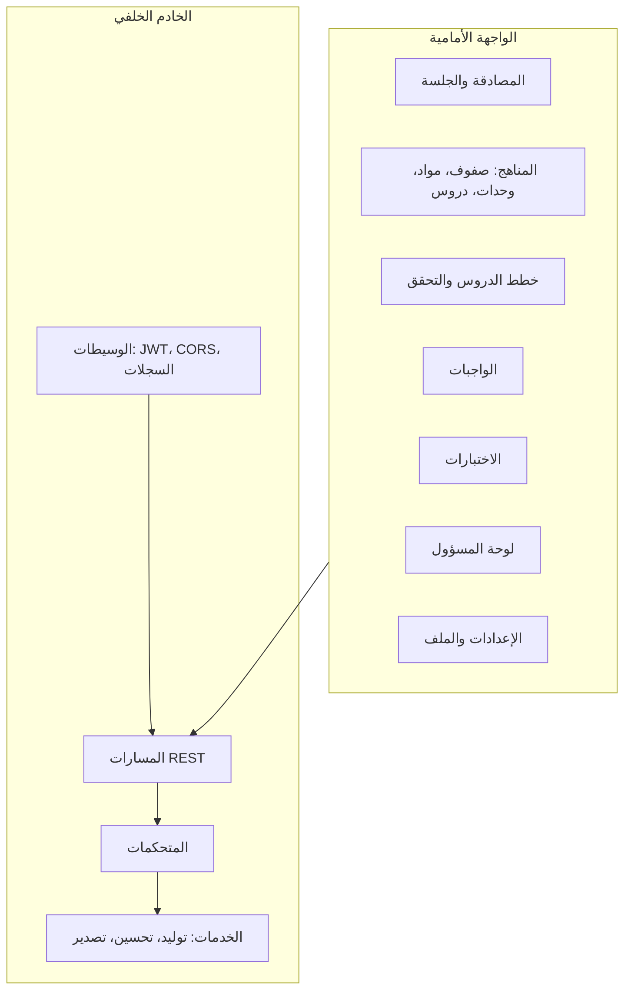
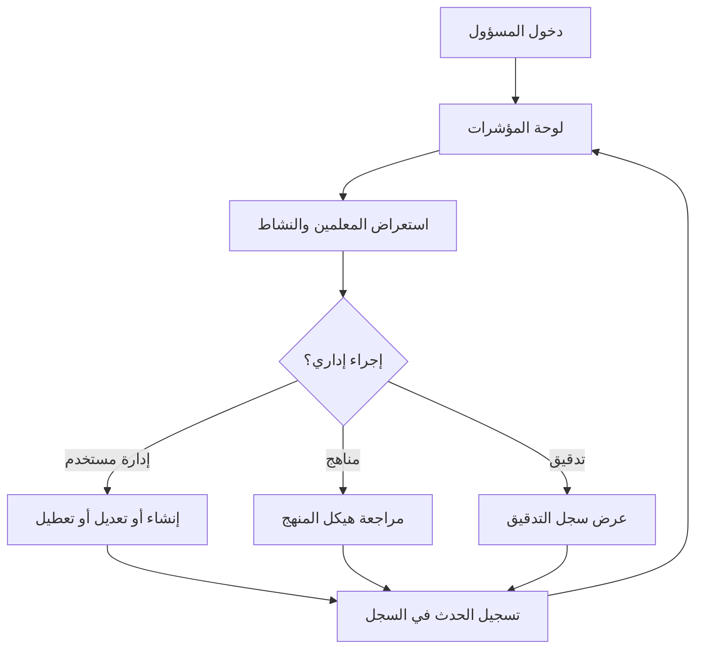
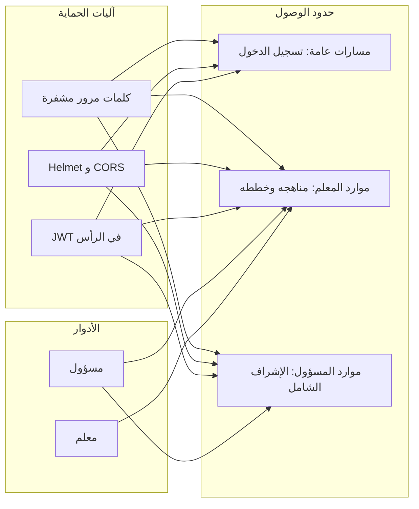

# مخططات Mermaid للرسالة (منصة مساعد المعلم)

## 1) مخطط سياق النظام

## 2) مخطط تفاعل أصحاب المصلحة

## 3) البنية المعمارية عالية المستوى

## 4) تدفق البيانات الرئيسي

## 5) مسار الاستخدام الرئيسي (رحلة المستخدم)

## 6) مخطط تسلسل: توليد خطة الدرس

## 7) نموذج البيانات المفاهيمي (ER)

## 8) مخطط الوحدات والمكونات

## 9) تدفق الإدارة والإشراف

## 10) الأمان وضبط الوصول

